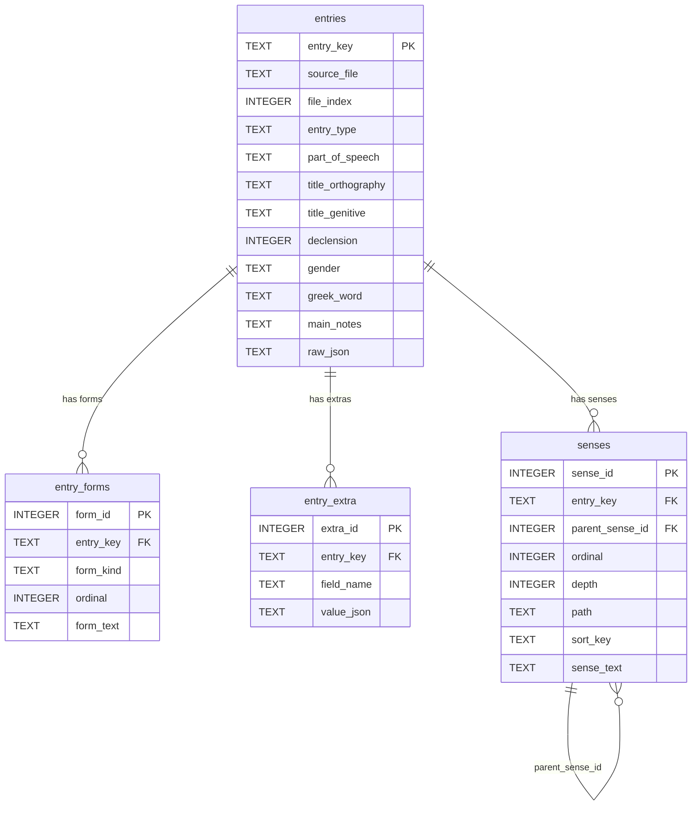
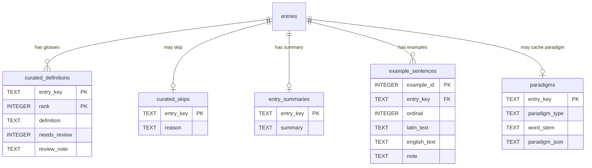

# SQLite schema sketches

**Status: prototype / not frozen.**

These files are a readable picture of the tables `tools/ls_db.py` creates
(and a few drafted tables for the curated layer that is still file-based).
They are for looking at — in an editor, a SQL GUI, or a diagram tool — not
a contract the loader is required to follow.

- Prefer evolving the SQL when the product shape changes.
- The live schema is still the Python in `tools/ls_db.py` (`create_schema`).
- Do not treat column names, foreign keys, or the draft tables as locked.

```
schema/
  schema.sql              all four live tables + indexes, one file
  entries.sql
  entry_forms.sql
  entry_extra.sql
  senses.sql
  draft/                  curated layer — not created by ls_db.py yet
    curated_definitions.sql
    curated_skips.sql
    entry_summaries.sql
    example_sentences.sql
    paradigms.sql
    schema.sql            all five draft tables, one file
```

Load the live sketch into a throwaway database:

```
sqlite3 /tmp/ls-schema-preview.db < schema/schema.sql
```

The draft files assume the live tables already exist (they reference
`entries.entry_key`). Load them after `schema.sql` if you want the full picture.

## What is live vs drafted

| Table | Status | Source |
| --- | --- | --- |
| `entries` | created by `ls_db.py load` | `ls_*.json` scalars + optional `raw_json` |
| `entry_forms` | created by `ls_db.py load` | `alternative_orthography` / `alternative_genative` |
| `entry_extra` | created by `ls_db.py load` | unrecognised JSON fields (empty today) |
| `senses` | created by `ls_db.py load` | nested `senses` tree, flattened |
| `curated_definitions` | draft | `definitions/<LETTER>.txt` |
| `curated_skips` | draft | `# skip:` lines in those files |
| `entry_summaries` | draft | API `summary` field (case governance, etc.) |
| `example_sentences` | draft | learner examples on the entry page |
| `paradigms` | draft | cached declension / conjugation grids |

## Differences from the live loader

The sketches add a few things the Python DDL does not, because they make the
relationships visible:

- `FOREIGN KEY` clauses (the loader sets `PRAGMA foreign_keys = ON` but does
  not declare the keys)
- `UNIQUE` / `CHECK` hints where the data already behaves that way
- comments on every column

Ids (`form_id`, `extra_id`, `sense_id`) are assigned by the loader, not by
`AUTOINCREMENT`. The sketches keep that: `INTEGER PRIMARY KEY` with no
autoincrement clause.

`raw_json` is included. `load --no-raw` omits that column.

## Entity picture (live tables)



## Entity picture (draft curated layer)

These hang off `entries` the same way. None of them are created by `ls_db.py` yet.


